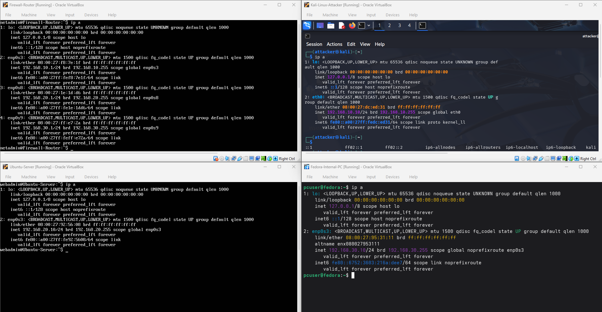
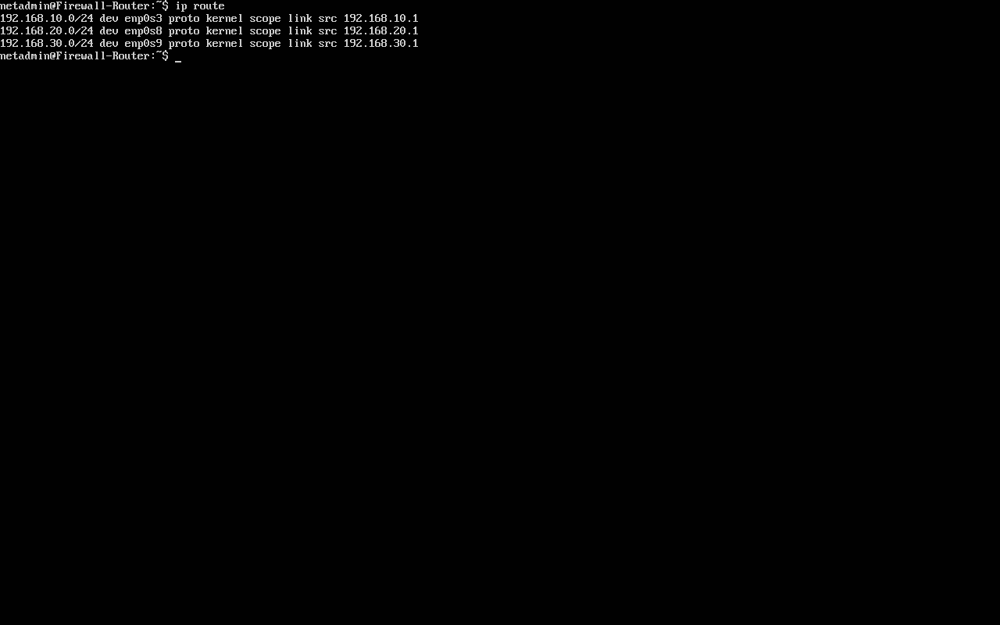
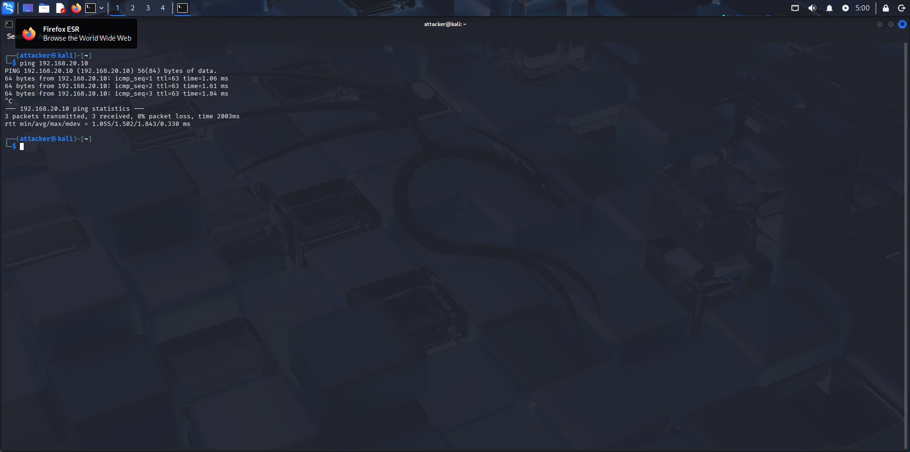
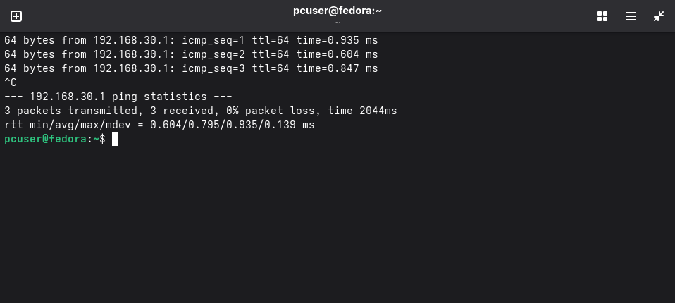
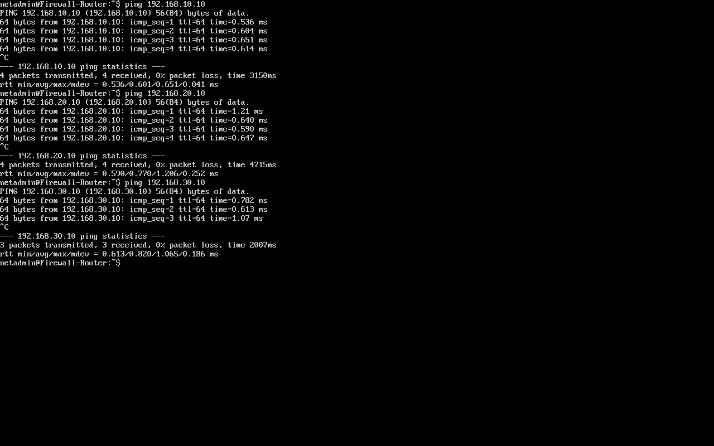
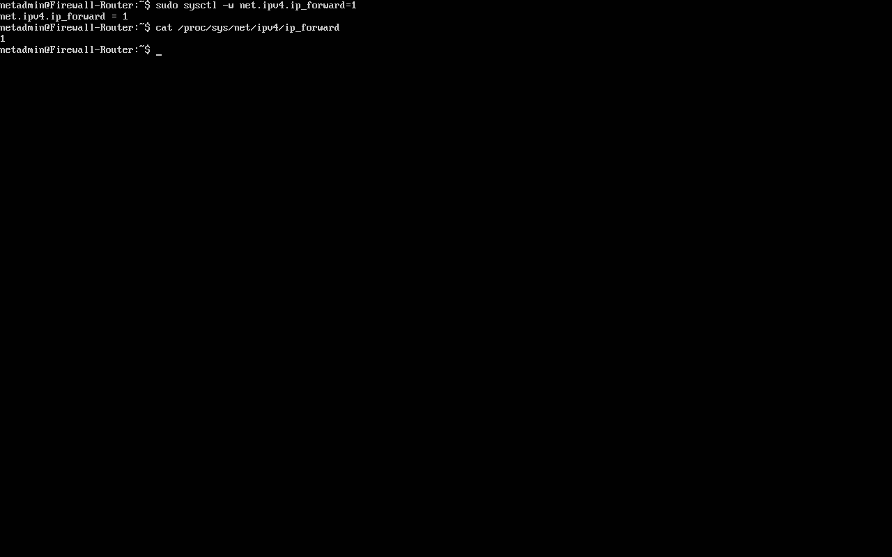

# Cybersecurity Home Network Lab

## Objective
Build a segmented network to simulate real-world attacker and defender scenarios.

## Skills Demonstrated
- Network segmentation
- Firewall configuration
- Traffic monitoring
- Security testing

## Lab Architecture
The network architecture is documented using Cisco Packet Tracer.
A topology diagram and IP addressing plan are included in the `diagrams/` directory.

## Security Controls Implemented
- Restricted network access
- Firewall rules (iptables / ACLs)
- Traffic inspection

## Attack Simulation
- Port scanning
- ICMP blocking
- Service enumeration

## Lessons Learned
- Importance of least privilege
- Visibility through logging
- Common misconfigurations

## Portfolio Use
This project demonstrates practical network security, attack detection,
and documentation skills relevant to SOC Analyst and Security+ roles.

## Network Configuration Validation

After configuring the segmented home network, connectivity tests were performed to verify correct routing between network segments.

### Router Interface Configuration

The firewall/router was configured with three interfaces connected to separate networks:

- 192.168.10.0/24 – Attacker Network (Kali Linux)
- 192.168.20.0/24 – Server Network (Ubuntu Server)
- 192.168.30.0/24 – Internal Workstation (Fedora)

### Routing Table Verification

The routing table confirms the router recognizes all configured subnets.

### Attacker Network Test

The Kali attacker machine successfully reached the Ubuntu server using ICMP.

### Internal Network Test

The Fedora workstation successfully reached the router gateway.

### Router Connectivity Test

The router successfully communicated with hosts across all three networks.

## Enabling Packet Forwarding

To allow the firewall-router to route traffic between the segmented networks, IPv4 forwarding was enabled.
Command used: sudo sysctl -w net.ipv4.ip_forward=1
Verification command: cat /proc/sys/net/ipv4/ip_forward

The output returned `1`, confirming that packet forwarding is active.

