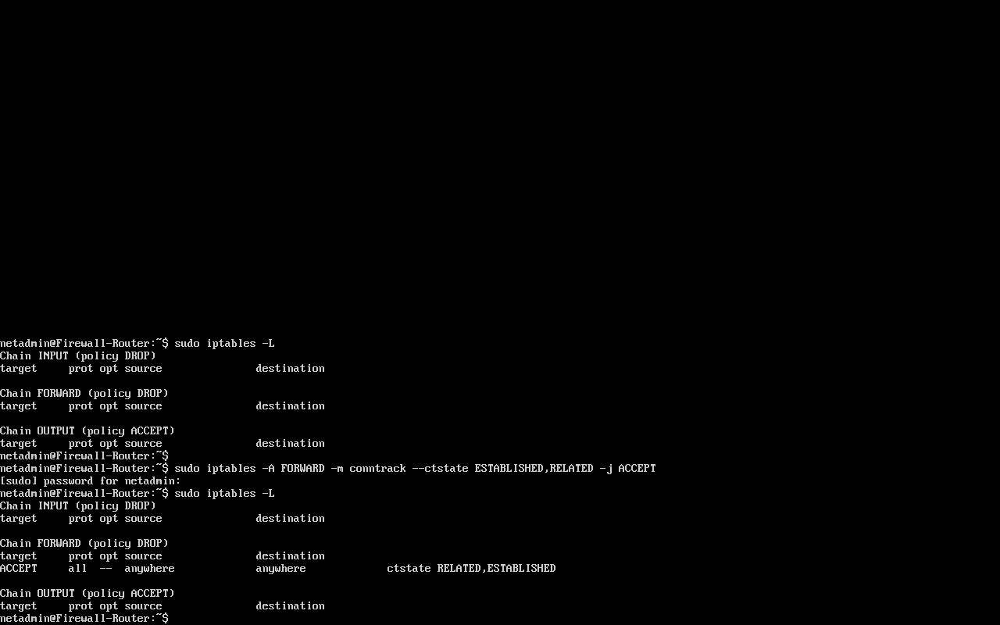
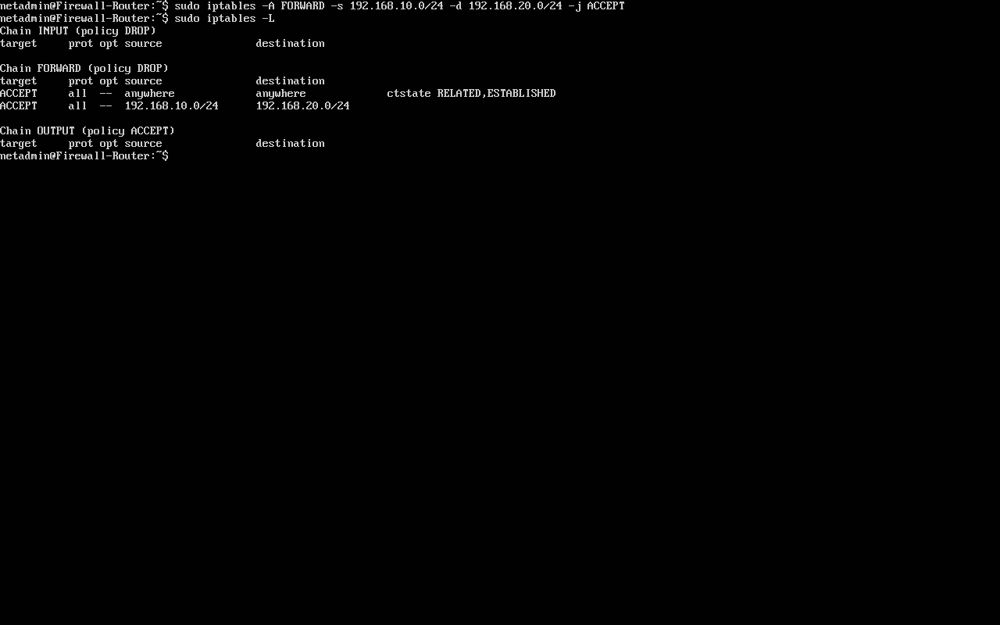
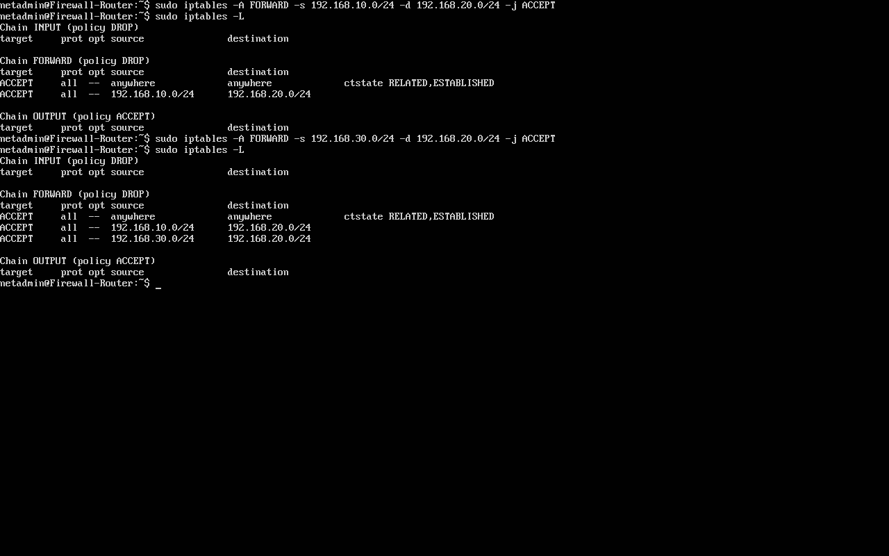
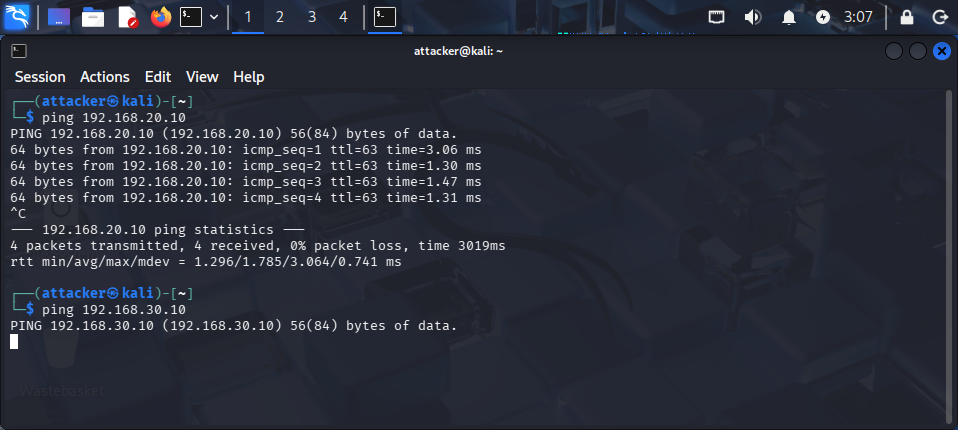
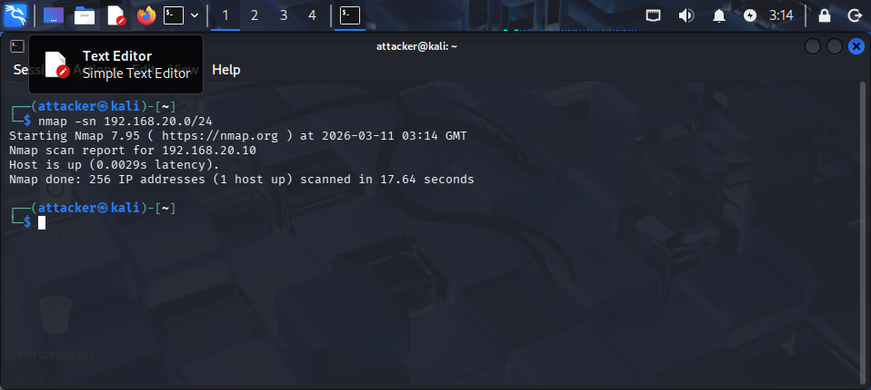
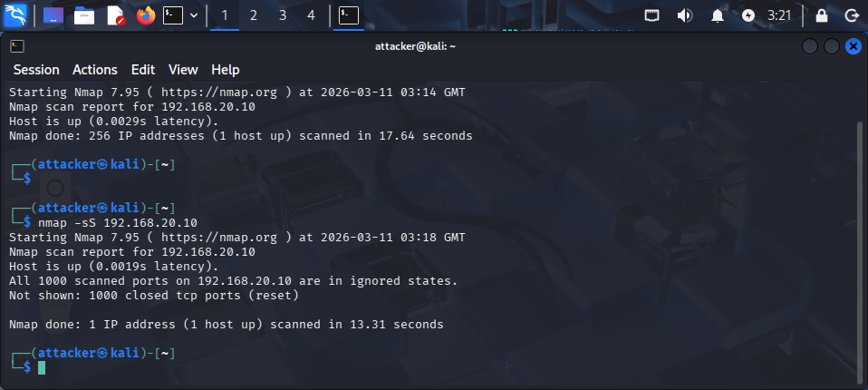

# Cybersecurity Home Network Lab

## Objective
Build a segmented network to simulate real-world attacker and defender scenarios.

## Skills Demonstrated
- Network segmentation
- Firewall configuration
- Traffic monitoring
- Security testing

## Lab Architecture
The network architecture is documented using Cisco Packet Tracer.
A topology diagram and IP addressing plan are included in the `diagrams/` directory.

## Security Controls Implemented
- Restricted network access
- Firewall rules (iptables / ACLs)
- Traffic inspection

## Attack Simulation
- Port scanning
- ICMP blocking
- Service enumeration

## Lessons Learned
- Importance of least privilege
- Visibility through logging
- Common misconfigurations

## Portfolio Use
This project demonstrates practical network security, attack detection,
and documentation skills relevant to SOC Analyst and Security+ roles.

## Network Configuration Validation

After configuring the segmented home network, connectivity tests were performed to verify correct routing between network segments.

### Router Interface Configuration

The firewall/router was configured with three interfaces connected to separate networks:

- 192.168.10.0/24 – Attacker Network (Kali Linux)
- 192.168.20.0/24 – Server Network (Ubuntu Server)
- 192.168.30.0/24 – Internal Workstation (Fedora)


### Routing Table Verification

The routing table confirms the router recognizes all configured subnets.


### Attacker Network Test

The Kali attacker machine successfully reached the Ubuntu server using ICMP.


### Internal Network Test

The Fedora workstation successfully reached the router gateway.


### Router Connectivity Test

The router successfully communicated with hosts across all three networks.


## Enabling Packet Forwarding

To allow the firewall-router to route traffic between the segmented networks, IPv4 forwarding was enabled.
Command used: sudo sysctl -w net.ipv4.ip_forward=1
Verification command: cat /proc/sys/net/ipv4/ip_forward


The output returned `1`, confirming that packet forwarding is active.


## Default Firewall Policy

The firewall was configured using a **default deny** security policy.

Commands used:

sudo iptables -P INPUT DROP
sudo iptables -P FORWARD DROP
sudo iptables -P OUTPUT ACCEPT

This ensures that traffic is blocked unless explicitly allowed.

Verification:


## Allowing Established Connections

To maintain proper network communication, the firewall allows established and related connections.

Command used:

sudo iptables -A FORWARD -m conntrack --ctstate ESTABLISHED,RELATED -j ACCEPT

This ensures that return traffic from allowed connections is not blocked.



## Allow Kali Attacker Network to Reach Server

To simulate attacker behavior for testing purposes, traffic from the Kali attacker network was allowed to reach the Ubuntu server network.

Command used:

sudo iptables -A FORWARD -s 192.168.10.0/24 -d 192.168.20.0/24 -j ACCEPT

This allows the attacker system to interact with the server during later attack simulations.



## Allow Internal Workstation Access to Server

To allow legitimate internal access, the Fedora workstation network was allowed to communicate with the Ubuntu server network.

Command used:

sudo iptables -A FORWARD -s 192.168.30.0/24 -d 192.168.20.0/24 -j ACCEPT

This rule enables internal users to access services hosted on the server while still maintaining segmentation between network zones.



## Firewall Segmentation Testing

Connectivity tests were performed from the Kali attacker machine to validate firewall rules.

### Kali → Server (Allowed)

The attacker machine successfully communicated with the Ubuntu server network.

This confirms the firewall rule allowing attacker network access to the server.

### Kali → Internal Workstation (Blocked)

The firewall blocked traffic from the attacker network to the internal workstation network.

This demonstrates proper network segmentation and prevents attacker lateral movement.



## Attacker Network Discovery

The Kali attacker machine performed a network discovery scan against the server subnet.

Command used:

nmap -sn 192.168.20.0/24

This scan identifies active hosts without performing port scans.

Result:
The Ubuntu server (192.168.20.10) was successfully discovered on the network.



## Nmap SYN Port Scan

A stealth SYN scan was performed from the Kali attacker machine against the Ubuntu server.

Command used:

nmap -sS 192.168.20.10

Results showed that all scanned ports were closed, indicating that no services were currently exposed on the server.

This demonstrates that even though the attacker can discover the host, the server is not currently exposing attackable services.



## Allowing Server Network Access Through Firewall

During testing, the Ubuntu server could not reach the router or external networks due to firewall restrictions.

To allow the server subnet to communicate with the router and initiate outbound connections, the following rules were added:

sudo iptables -A INPUT -s 192.168.20.0/24 -j ACCEPT
sudo iptables -A FORWARD -s 192.168.20.0/24 -j ACCEPT

This allowed the server to access external resources such as DNS servers and Ubuntu repositories.

## Enabling NAT for Internet Access

To allow internal lab networks to access the internet through the firewall router, NAT masquerading was configured.

Command used:

sudo iptables -t nat -A POSTROUTING -o enp0s3 -j MASQUERADE

This allows internal IP addresses to be translated to the router's external interface, enabling internet access for lab machines.

### Fixing Ubuntu Server Internet Connectivity

During the lab setup, the Ubuntu Server was unable to access the internet and `apt update` failed with errors such as **"No route to host"** and **"Unable to connect to archive.ubuntu.com"**.

Troubleshooting steps included:

* Verifying routing configuration on the Ubuntu Server
* Confirming the default gateway was set to the firewall router (`192.168.20.1`)
* Ensuring IP forwarding was enabled on the router
* Adding firewall forwarding rules to allow outbound traffic from the server network

The following firewall rules were added on the router:

```
sudo iptables -A FORWARD -s 192.168.20.0/24 -o enp0s3 -j ACCEPT
sudo iptables -A FORWARD -d 192.168.20.0/24 -m conntrack --ctstate ESTABLISHED,RELATED -j ACCEPT
```

Once the routing and firewall rules were corrected, the server successfully reached external IP addresses and `apt update` completed successfully.

Apache was then installed to simulate a web service inside the lab environment.

```
sudo apt update
sudo apt install apache2 -y
```

This prepares the Ubuntu Server to act as a target system for attacker reconnaissance and service enumeration.

