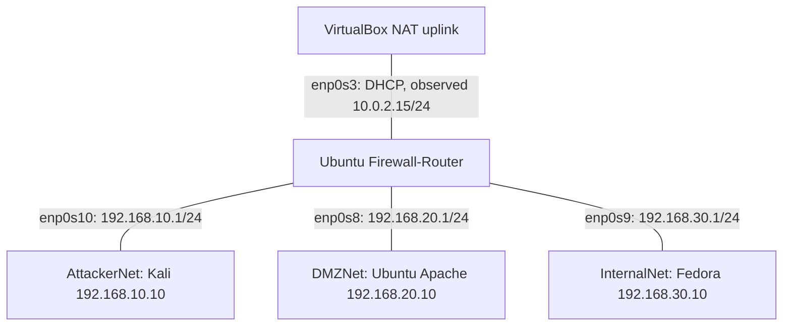

# VirtualBox Implementation

This diagram shows network attachments, not unrestricted traffic permissions.
Firewall-Router is the only VM attached to all three lab zones.

## Attachments and addressing

| VM | Guest interface | VirtualBox attachment | Address | Default gateway |
|---|---|---|---|---|
| Firewall-Router | enp0s3 | NAT | DHCP; observed 10.0.2.15/24 | 10.0.2.2 |
| Firewall-Router | enp0s10 | Internal Network: AttackerNet | 192.168.10.1/24 | — |
| Firewall-Router | enp0s8 | Internal Network: DMZNet | 192.168.20.1/24 | — |
| Firewall-Router | enp0s9 | Internal Network: InternalNet | 192.168.30.1/24 | — |
| Kali | eth0 | Internal Network: AttackerNet | 192.168.10.10/24 | 192.168.10.1 |
| Ubuntu-Server | enp0s8 | Internal Network: DMZNet | 192.168.20.10/24 | 192.168.20.1 |
| Fedora | enp0s3 | Internal Network: InternalNet | 192.168.30.10/24 | 192.168.30.1 |

Guest interface names may differ in a rebuilt VM. Verify their network
attachments before adapting the exported rules.

## Forwarding behavior

- New TCP/80 connections from attacker and internal subnets to the DMZ server are allowed.
- ESTABLISHED and RELATED return traffic is accepted.
- Tested attacker-to-internal and DMZ-to-internal ICMP and TCP/8080 traffic is blocked.
- Remaining forwarding defaults to DROP. The exported NAT table has no translation rules.
- The NAT uplink serves the router; it does not provide general forwarded Internet access to the other VMs.
- The router's own test traffic uses OUTPUT, not FORWARD. Its successful TCP/8080 request was a service availability control.

The Windows host runs VirtualBox; it is not an additional routed lab zone.
A temporary shared folder was used for exporting evidence and is not shown as a network link.

See [security policy](../firewall-rules/security-policy.md),
[validation](../docs/validation.md), and [test reproduction](../docs/reproduce-tests.md).
