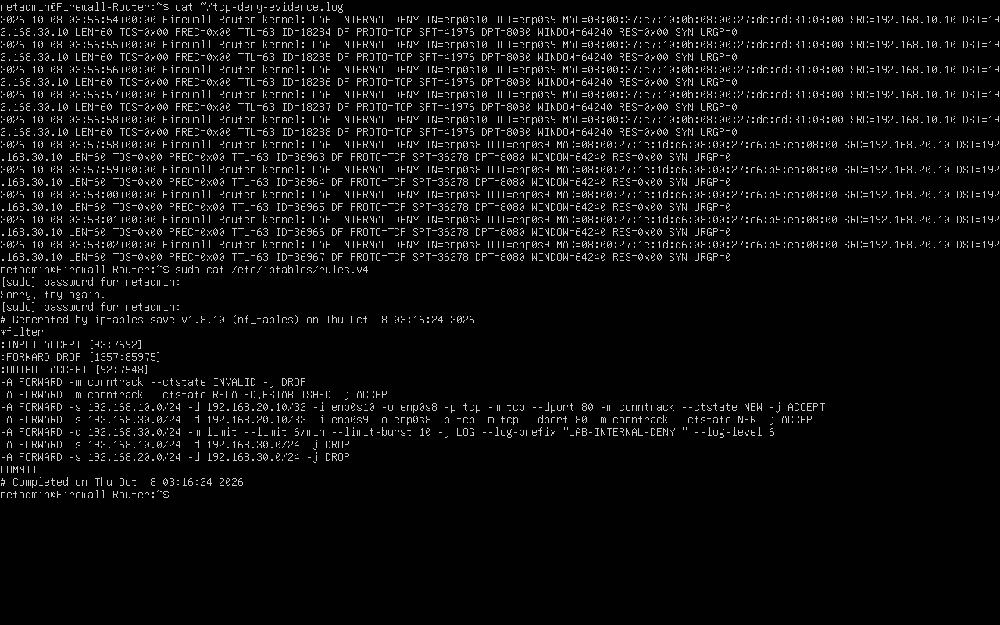
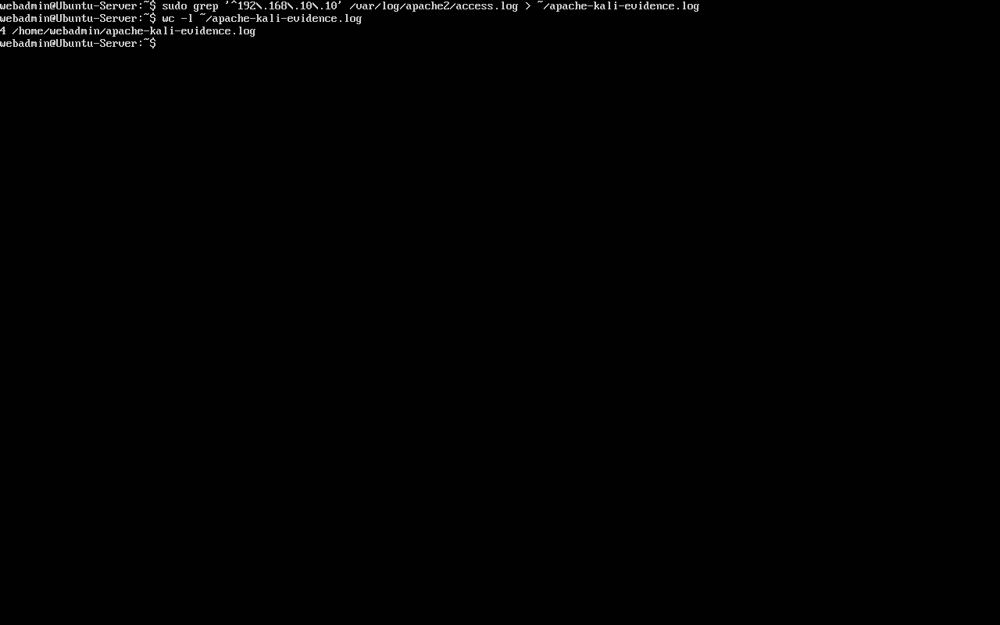
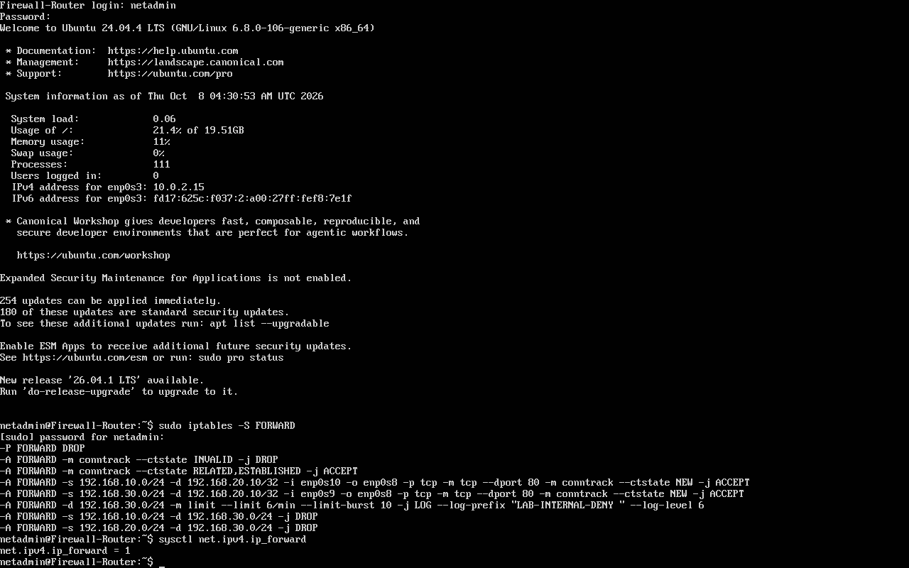

# Network Segmentation Validation

## Purpose

Validate the VirtualBox implementation against the security policy
in `firewall-rules/security-policy.md`.

This document records the revalidation of the lab after configuration
troubleshooting. The [setup history](setup-history.md) describes previous setup stages;
their firewall commands should not be treated as the current ruleset.

## Validated Environment

| System | IPv4 address | Role |
|---|---|---|
| Kali Linux | 192.168.10.10 | Attacker network |
| Ubuntu Server | 192.168.20.10 | DMZ Apache server |
| Fedora | 192.168.30.10 | Internal workstation |

The firewall provides the .1 gateway in each subnet:

| Firewall interface | Network |
|---|---|
| enp0s10 | Attacker: 192.168.10.0/24 |
| enp0s8 | DMZ: 192.168.20.0/24 |
| enp0s9 | Internal: 192.168.30.0/24 |
| enp0s3 | VirtualBox NAT uplink |

The Cisco Packet Tracer topology represents the logical design.
The interface names above belong to the VirtualBox implementation.

## Segmentation Policy and Current Egress

- Default FORWARD policy: DROP.
- Drop packets classified as INVALID.
- Accept ESTABLISHED and RELATED traffic.
- Allow new TCP connections from the attacker and internal networks
  to 192.168.20.10 on port 80.
- Log remaining traffic destined for the internal network using
  the prefix `LAB-INTERNAL-DENY`.
- Explicitly drop attacker-to-internal and DMZ-to-internal traffic.
- Later addition: permit Ubuntu-only DNS to 8.8.8.8 UDP/53 and NTP to
  186.177.18.74 UDP/123, with matching NAT; see [follow-up](ntp-recovery.md).

Logging is limited to 6 packets per minute with a burst of 10.
This limits log volume, not enforcement. The LOG target does not
drop packets; subsequent DROP rules enforce the restriction.

## Test Results

| Source | Destination | Test | Observed result |
|---|---|---|---|
| Kali | DMZ server | HTTP, TCP 80 | HTTP 200 |
| Fedora | DMZ server | HTTP, TCP 80 | HTTP 200 |
| Firewall | Fedora | ICMP | Replies received |
| Kali | Fedora | ICMP | No replies; DROP counter increased |
| DMZ server | Fedora | ICMP | No replies; DROP counter increased |
| Firewall | Fedora | HTTP, TCP 8080 | HTTP 200: control test |
| Kali | Fedora | TCP 8080 | Timeout, SYN logs and DROP counter increase |
| DMZ server | Fedora | TCP 8080 | Timeout, SYN logs and DROP counter increase |

A temporary Python HTTP server was bound to 192.168.30.10:8080
for the TCP tests. The firewall's successful HTTP request confirmed
that the service was available before testing the restricted paths.

After testing, the temporary server was stopped.
`ss -lnt 'sport = :8080'` showed no listening socket.

## Log Analysis

Two evidence files were exported on Firewall-Router:

| Local file | Exported lines |
|---|---|
| /home/netadmin/internal-deny-evidence.log | 9 |
| /home/netadmin/tcp-deny-evidence.log | 10 |

Original copies are now published as [ICMP evidence](../logs/internal-deny-evidence.log)
and [TCP evidence](../logs/tcp-deny-evidence.log).
See the [evidence inventory](../logs/README.md) for provenance and limitations.

The TCP test produced five logged SYN packets from Kali and five
from the DMZ server, targeting 192.168.30.10:8080.

These packets include retransmissions from controlled connection
attempts. They do not represent ten separate attacks.

Timeouts alone would not establish firewall enforcement.
The conclusion is supported by the service availability control,
matching firewall logs, and increases in the corresponding DROP counters.

## Allowed HTTP Traffic: Apache Evidence

After restoring access to Firewall-Router, Kali received HTTP 200
from the DMZ web server at 192.168.20.10.

Apache's access log recorded the request with these fields:

- Source: 192.168.10.10 (Kali)
- Request: HEAD / HTTP/1.1
- Response status: 200
- Reported User-Agent: curl/8.17.0
- Server-recorded timestamp: 08/Oct/2026:17:37:42 +0000

Four Kali access-log entries were exported to
/home/webadmin/apache-kali-evidence.log on Ubuntu-Server.
An unchanged copy is published as [Apache evidence](../logs/apache-kali-evidence.log).

This confirms application-level visibility of permitted HTTP traffic.
The request was an authorized connectivity test, not evidence of
malicious activity. Cross-system clock alignment remains unverified.

## Persistence

After rebooting Firewall-Router, verification confirmed that
all seven FORWARD rules were restored, including the
LAB-INTERNAL-DENY logging rule.

The FORWARD policy remained DROP, and
net.ipv4.ip_forward remained set to 1.

## Scope and Remaining Limitations

- Results apply to the tested IPv4 paths and protocols.
- Router INPUT and OUTPUT policies remain ACCEPT.
- IPv6 filtering was not validated.
- Setup-history NAT and Internet-access steps are historical;
  general forwarded Internet access remains unavailable. Narrow DNS/NTP
  exceptions were subsequently verified; see [follow-up](ntp-recovery.md).
- Ubuntu Server required recovery-mode troubleshooting earlier.
  A subsequent normal boot succeeded, but intermittent VM startup
  problems remain unresolved.
- Clock alignment across all VMs remains to be verified before
  correlating timestamps from multiple systems.
- These were authorized lab tests, not evidence of a real compromise.

## Historical Time Synchronization Limitation

**Update:** Router and Ubuntu synchronization has since been observed; see
[DNS/NTP recovery](ntp-recovery.md). The following describes the original
validation period and remains applicable to its unchanged log extracts.

During validation, Firewall-Router reported a synchronized clock,
while Ubuntu-Server reported an unsynchronized clock.

A temporary NTP configuration and narrowly scoped firewall/NAT
rules were tested. Ubuntu selected the intended NTP server but
timed out waiting for replies. The underlying cause was not resolved.

The temporary firewall/NAT rules were removed, and the Ubuntu
configuration override was disabled.

Existing logs remain useful for examining source and destination
addresses, ports, HTTP responses, and firewall enforcement.
However, precise cross-host event ordering cannot be established
from their timestamps. No exact clock offset was measured.
